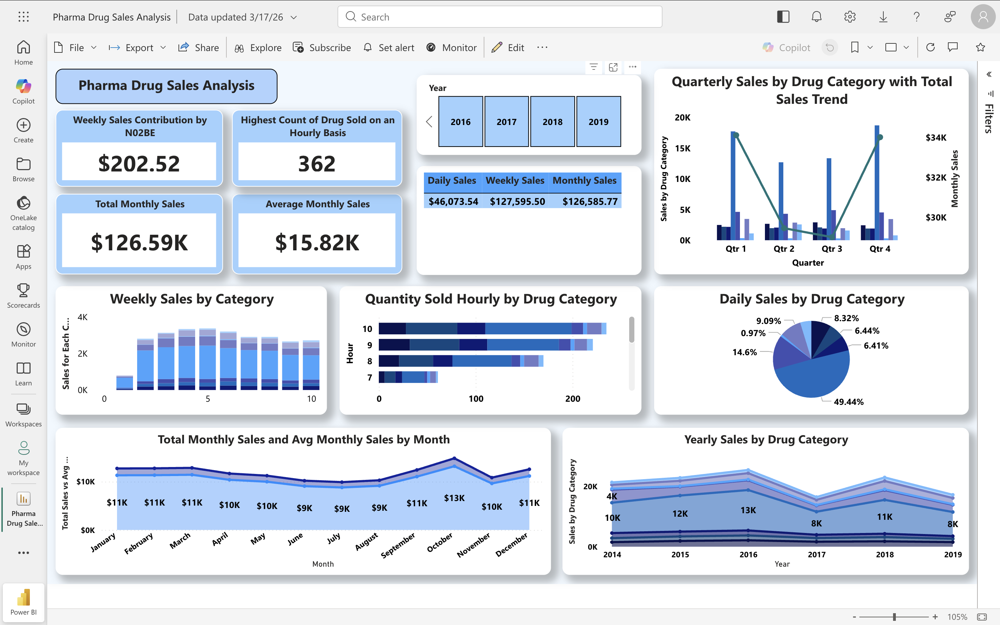

# Pharma Sales Performance & Demand Analysis (Power BI)

## Overview
This project analyzes pharmaceutical drug sales data to uncover trends across time, categories, and operational factors. The dashboard provides insights into sales performance, demand patterns, and opportunities for business optimization.

---

## Business Problem
Pharmaceutical companies need to track drug sales across multiple dimensions to:
- Identify high-performing products
- Understand seasonal demand patterns
- Optimize inventory and supply chain decisions
- Improve overall sales strategy

---

## Objective
- Analyze sales trends across daily, weekly, monthly, and yearly levels  
- Identify top-performing drug categories  
- Detect peak sales hours for operational planning  
- Evaluate sales distribution across categories  

---

## Tools & Technologies
- **Power BI** – Dashboard development & visualization  
- **Power Query** – Data cleaning and transformation  
- **DAX (Data Analysis Expressions)** – Measures and calculations  

---

## Data Overview
- Multi-year pharmaceutical sales dataset  
- Time dimensions: Hourly, Daily, Monthly, Yearly  
- Metrics: Sales Amount, Quantity Sold  
- Categories: Drug categories  

---

## Key Features of Dashboard
- Interactive filters (Year selection)  
- KPI cards for total, average, and contribution metrics  
- Time-based analysis (hourly to yearly trends)  
- Category-level performance comparison  
- Sales distribution visualization  

---

## Key Insights
- Q4 shows consistently higher sales across most drug categories  
- Sales decline observed during mid-year (June–August)  
- A single drug category contributes nearly 50% of daily sales  
- Peak sales occur during specific hours, indicating demand concentration  

---

## Business Recommendations
- Increase inventory and supply before Q4 peak season  
- Introduce targeted promotions during mid-year slowdown  
- Reduce dependency on a single high-performing category  
- Align staffing and logistics with peak hourly demand  

---

## Dashboard Preview

---

## How to Use
1. Download the `.pbix` file from this repository  
2. Open using Power BI Desktop  
3. Use filters to explore trends across different years and categories  

---

## Project Structure
